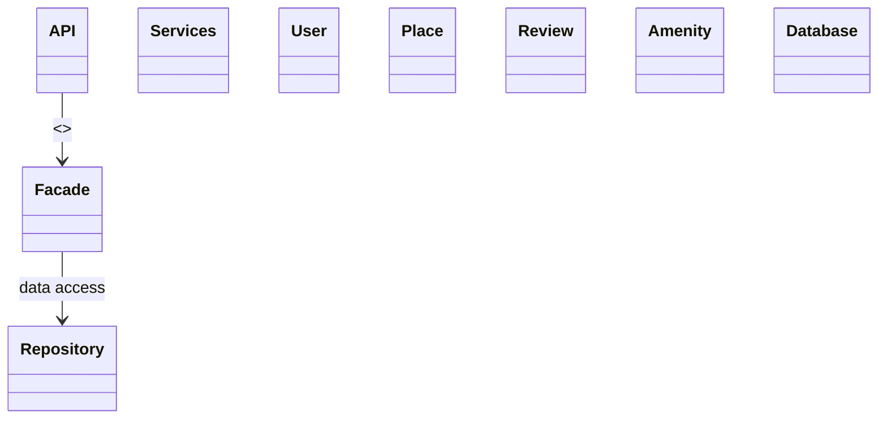

## High-Level Package Diagram


```md
## Architecture Overview

**Presentation Layer**  
Handles user interaction through APIs and services.

**Business Logic Layer**  
Contains core models and business rules. The Facade provides a unified entry point.

**Persistence Layer**  
Manages data storage and retrieval via repositories and the database.

**Facade Pattern**  
The facade simplifies communication between layers by reducing direct dependencies.
