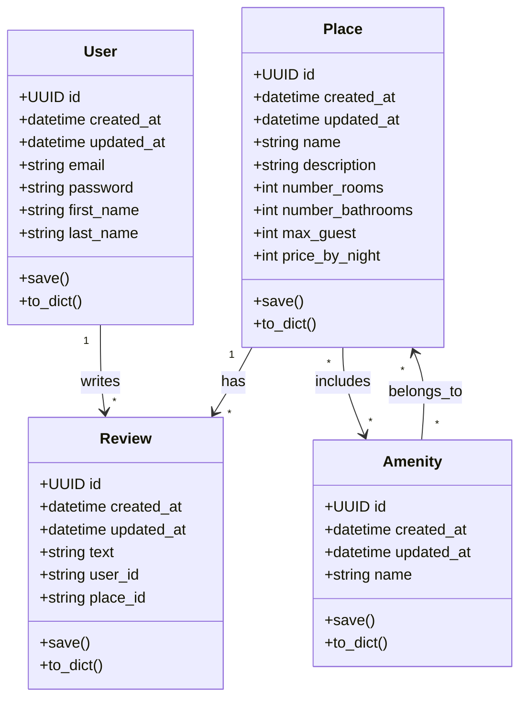

# HBnB Architecture Documentation

## High-Level Package Diagram

Business Logic Layer Overview

User
Represents a registered user. Stores login credentials and personal information. Responsible for writing Reviews.

Place
Represents a rental property. Stores attributes like rooms, bathrooms, max guests, and price. Can have multiple Reviews and multiple Amenities.

Review
Represents a review left by a User for a Place. Linked to both User and Place. Contains textual feedback.

Amenity
Represents a feature of a Place (e.g., Wi-Fi, pool). Many-to-many relationship with Place.

Relationships

User → Review: one-to-many

Place → Review: one-to-many

Place ↔ Amenity: many-to-many
