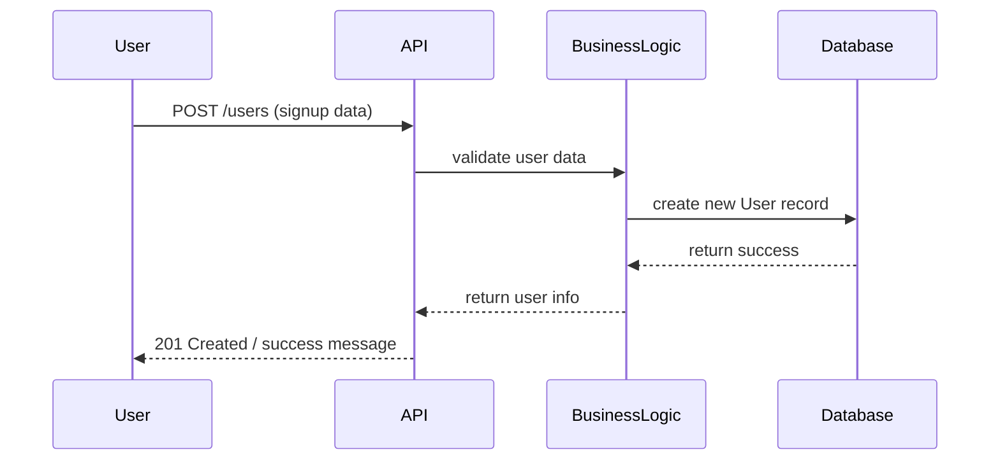
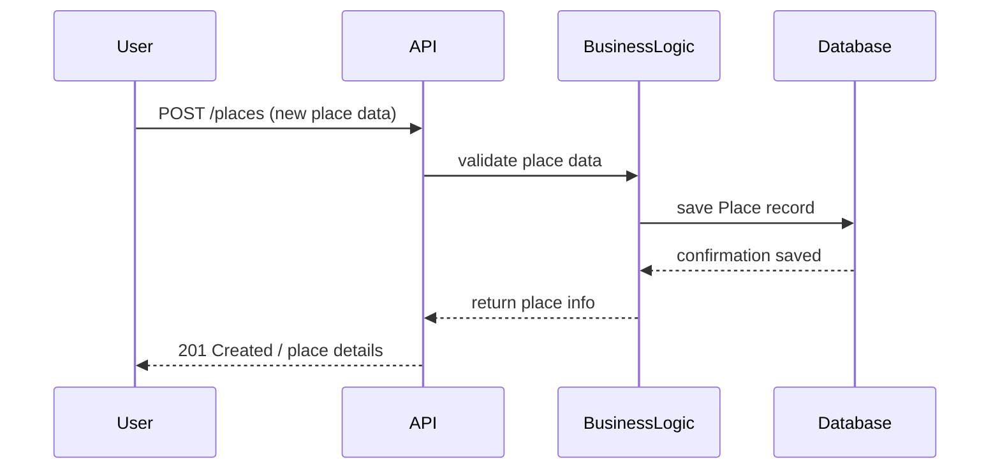
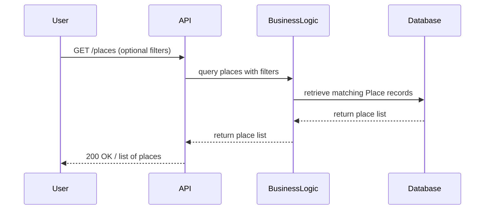

# HBnB API Sequence Diagrams

---

##  User Registration


Notes:

User data flows from API → BusinessLogic → Database

New user is created successfully

## Place Creation


Notes:

Adds a new rental listing

Validation and persistence handled by BusinessLogic and Database

## Review Submission

``mermaid
sequenceDiagram
participant User
participant API
participant BusinessLogic
participant Database

User->>API: POST /reviews (review text, place_id)
API->>BusinessLogic: validate review & user_id
BusinessLogic->>Database: save Review record
Database-->>BusinessLogic: confirmation saved
BusinessLogic-->>API: return review info
API-->>User: 201 Created / review details
```
Notes:

User submits a review for a place

Review linked to both User & Place

## Fetching a List of Places


Notes:

Shows data retrieval flow

Includes optional filtering logic in BusinessLogic

