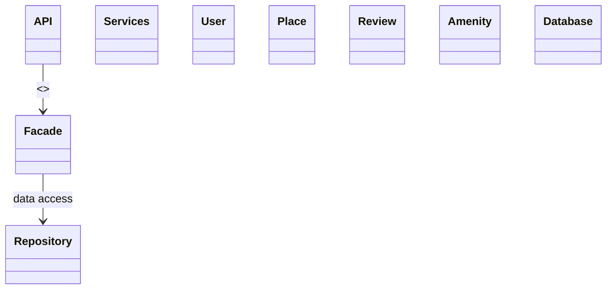
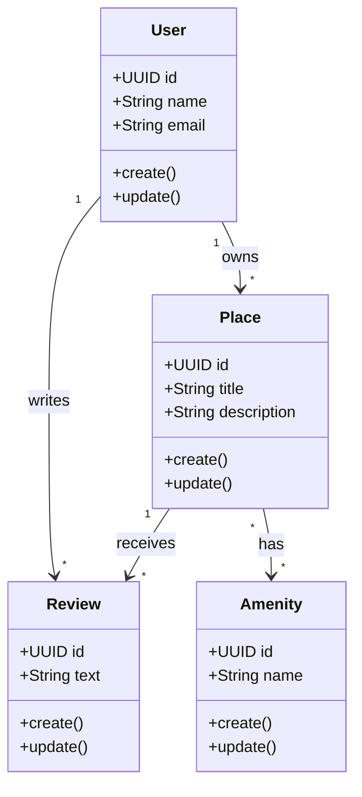
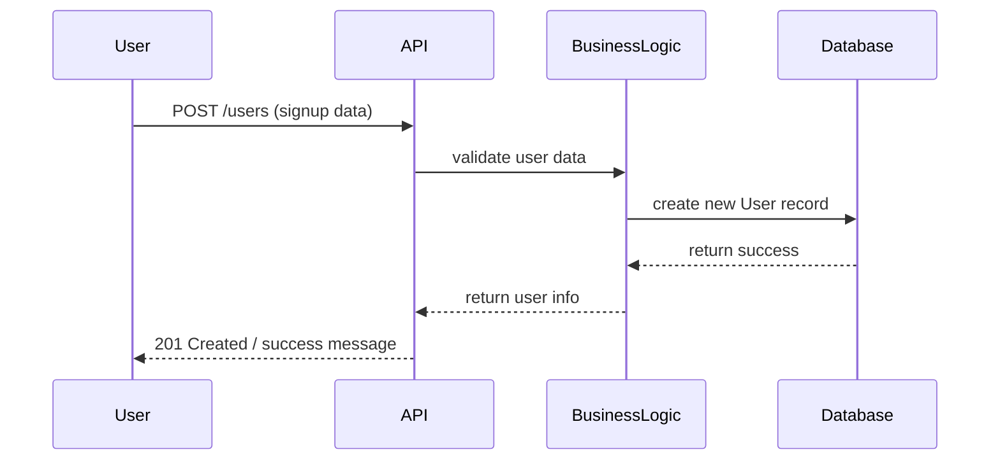
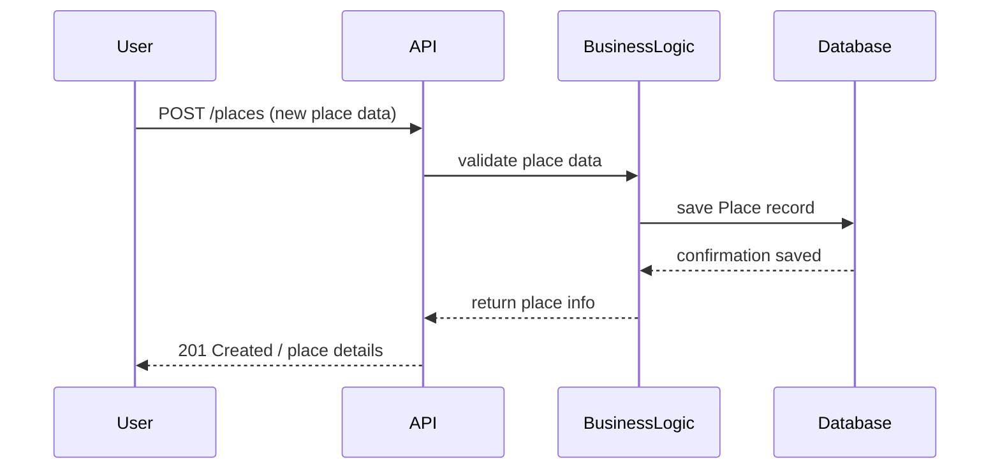
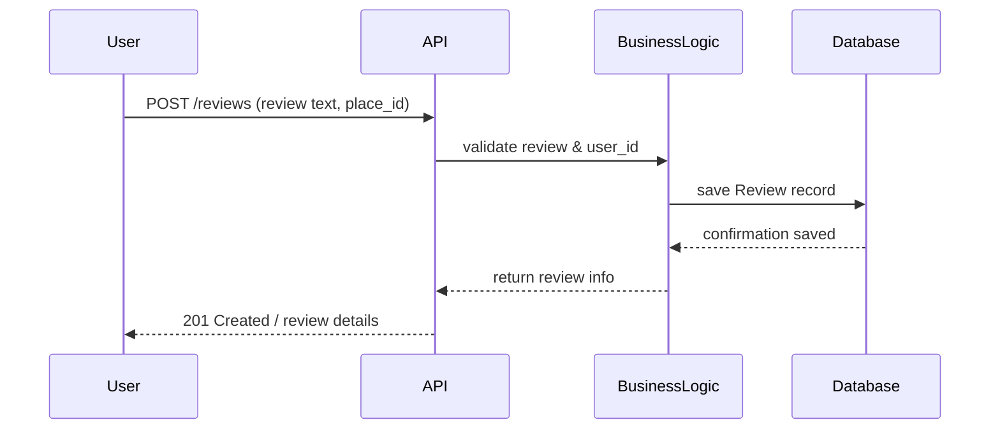
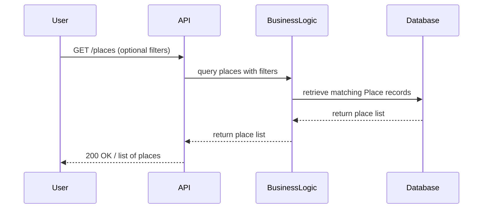

# HBnB Technical Documentation

---

## Introduction

The purpose of this document is to provide a comprehensive technical blueprint for the HBnB project.  
It consolidates all architecture and design diagrams, along with explanatory notes, to guide the implementation phase and serve as a reference for developers.

This document covers:

- High-Level Architecture (Package Diagram)  
- Business Logic Layer (Class Diagram)  
- API Interaction Flow (Sequence Diagrams)  

---

## High-Level Architecture

### Layered Architecture Overview

The HBnB application uses a three-layer architecture:

1. **Presentation Layer**: Handles user interactions via API and services.  
2. **Business Logic Layer**: Contains the core models representing entities like User, Place, Review, and Amenity.  
3. **Persistence Layer**: Responsible for data storage and retrieval from the database.  

The **Facade Pattern** is used to simplify communication between layers by providing a unified interface.

### High-Level Package Diagram

Notes:

Shows the three-layer architecture

API and Services interact with Business Logic through the Facade

Repository communicates with Database for persistence

## Detailed Class Diagram

Notes:

Each entity has a unique identifier (UUID) and timestamps (creation & update)

Relationships:

 -User can own multiple Places and write multiple Reviews

 -Place can have multiple Reviews and Amenities

This diagram captures the core business logic

## API Interaction Flow

**User Registration**

Notes:

User data flows from API → BusinessLogic → Database

New user is created successfully

**Place Creation**

Notes:

Adds a new rental listing

Validation and persistence handled by BusinessLogic and Database

**Review Submission**

Notes:

User submits a review for a place

Review linked to both User & Place

**Fetching a List of Places**

Notes:

Shows data retrieval flow

Includes optional filtering logic in BusinessLogic
--
## Conclusion

This document provides a complete reference for the HBnB project’s architecture and design.
It captures the high-level package structure, detailed business logic, and API interaction flows, serving as a guide for development and future maintenance.
